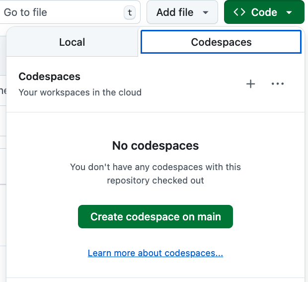
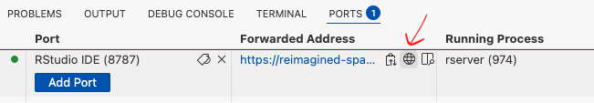

# RStudio_on_codespace
Launch RStudio server on GitHub Codespace

- Step 1: Create or relaunch codespace(s)

- Step 2: Open RStudio

**By clicking on the icon (red arrow highlighted), RStudio will be opened in a new tab of web browser. NOTE: make sure the Port is opened, indicated by a green light left to it**
